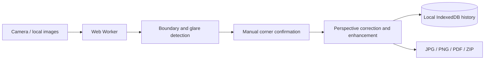

<p align="center">
  
</p>

<h1 align="center">Clear Scan</h1>

<p align="center">
  A privacy-first PWA for scanning identity documents and paper documents entirely in the browser.
</p>

<p align="center">
  <a href="./README.md">简体中文</a> · <strong>English</strong>
</p>

<p align="center">
  <a href="./LICENSE"></a>
  
  
  
  
</p>

<p align="center">
  <a href="https://github.com/rmb122/clear-scan">Source code</a> ·
  <a href="https://github.com/rmb122/clear-scan/issues">Report an issue</a>
</p>

## Overview

Clear Scan turns a phone or desktop browser into a lightweight document scanner. It accepts images from the system camera, a webcam, or local files, detects document boundaries, corrects perspective, and performs cropping, enhancement, history management, and export on the device.

The project has no image-upload API and requires no account. Original images and editing state are stored in the current browser's IndexedDB database, while image processing runs inside a Web Worker to keep the main interface responsive.

## Features

### Three scan modes

| Mode | Main capabilities | Typical output |
| --- | --- | --- |
| ID card | Guided capture for both sides, standard card-ratio detection, and perspective correction | Both sides arranged as large images on one A4 page; JPG, PNG, or PDF |
| Passport | Dedicated ratios for a single biodata page or a full two-page spread | JPG, PNG, or PDF; multi-page projects can use PDF or ZIP |
| Document | Batch import, continuous capture, page reordering, and multi-page management | Single-page JPG/PNG, multi-page PDF, or a ZIP of JPG files |

> The A4 ID-card layout prioritizes legibility by enlarging both sides. It is not a 1:1 physical-size photocopy.

### Capture and cropping

- Capture with the system camera or webcam, choose files from a gallery or desktop, or drag and drop images.
- Accepts JPEG, PNG, WebP, and HEIC/HEIF when the browser can decode them.
- Uses OpenCV.js for multi-candidate boundary detection, confidence scoring, and perspective correction.
- Requires manual confirmation when automatic detection is unreliable instead of silently accepting an unverified crop.
- Separates the four real corners from their drag handles so fingers do not cover the boundary; a magnifier and centered crosshair appear while dragging.
- Detects mild glare and severe overexposure, prompting a retake when information cannot be recovered reliably.

### Image enhancement

- Quick presets: Original and Smart Enhancement.
- Lighting repair: standard shadow removal and brightness balancing.
- Glare repair: local highlight suppression.
- Color styles: original color, enhanced color, grayscale, and black and white.
- Detail processing: sharpening.
- Fine controls for brightness, contrast, shadow or balancing strength, and sharpening strength.
- Clockwise and counterclockwise 90° rotation; effects from different categories can be combined.

### Local history and export

- Projects, source images, thumbnails, crop corners, and enhancement settings remain in the current browser.
- Search by project name, filter by scan mode, delete individual projects, or clear all history.
- Export is generated locally without a server-side conversion service.
- Exported JPG and PNG files are re-encoded and do not retain the source photo's EXIF or location metadata.

| Format | Best for | Notes |
| --- | --- | --- |
| PDF | Document archiving and multi-page scans | Documents can fit their content or use uniform A4 pages; ID cards use one enlarged A4 sheet |
| JPG | A single page or a combined two-sided ID image | Broad compatibility with lossy compression |
| PNG | A single page or a combined two-sided ID image | Lossless, but generally larger |
| ZIP | Multi-page passport or document projects | Renders every page as a separate JPG and packages them together |

## Workflow

1. Choose ID card, passport, or document mode.
2. Take a photo or import images from a gallery or computer.
3. Review the detected corners and, when necessary, refine them with the offset handles and magnifier.
4. Choose a preset, combine enhancement effects, rotate, or fine-tune individual parameters.
5. Confirm every page and export. The project remains in local history until it is deleted manually.

## Processing and data flow



There is no cloud image-processing step. The first visit still downloads the application assets and OpenCV engine; after those resources are cached, the app can continue working offline.

## Privacy and limitations

- The application code does not intentionally upload scan images. Sensitive documents should still be handled on a trusted device, browser, and deployment origin.
- Scan history belongs to the current browser profile. Clearing site data, using private browsing, or reaching a storage quota can remove or prevent history from being saved.
- The PWA cache and scan history are separate. Uninstalling the PWA may not delete IndexedDB; clearing the browser's site data removes both completely.
- The current release has no OCR, MRZ text recognition, cloud sync, account system, electronic signatures, or server-side backup.
- Glare suppression can reduce highlights that still contain detail, but it cannot recover text from fully clipped white areas.
- HEIC/HEIF import depends on image-decoding support in the browser and operating system.
- Webcam access, Service Workers, and PWA installation normally require HTTPS or `localhost`. Plain HTTP can still be used for basic image-upload testing.

## Technology stack

| Area | Technology |
| --- | --- |
| UI | React 19, TypeScript, Tailwind CSS 4, Radix UI, Lucide |
| Build | Vite 8 |
| Image processing | OpenCV.js, Web Worker, OffscreenCanvas |
| Local storage | Dexie, IndexedDB |
| File export | pdf-lib, JSZip, Canvas encoding |
| PWA | vite-plugin-pwa, Workbox |
| State and routing | Zustand, React Router |
| Quality | Vitest, Testing Library, Playwright, Oxlint, TypeScript |

## Local development

### Requirements

- Node.js `^20.19.0` or `>=22.12.0`
- pnpm 11 recommended

### Start the development server

```bash
git clone https://github.com/rmb122/clear-scan.git
cd clear-scan
pnpm install
pnpm dev
```

Open the local URL printed by Vite. Development uses `/` as the base path.

### Production build and preview

```bash
pnpm build
pnpm preview
```

The production output is written to `dist/`.

### Quality checks

```bash
pnpm lint
pnpm typecheck
pnpm test
pnpm test:e2e
```

Before running the end-to-end suite for the first time, install Playwright Chromium if it is not already available:

```bash
pnpm exec playwright install chromium
```

## Deploying to GitHub Pages

The repository includes a [GitHub Pages workflow](./.github/workflows/pages.yml). Its default configuration targets a project site named `clear-scan`, so Vite uses `/clear-scan/` as the base path during GitHub Actions builds.

1. Push the repository to GitHub.
2. Open **Settings → Pages** in the repository.
3. Under **Build and deployment**, set Source to **GitHub Actions**.
4. Push to `main`, or manually run `Deploy GitHub Pages` from the Actions tab.

If the repository is not named `clear-scan`, update `pagesBase` in [`vite.config.ts`](./vite.config.ts). A root domain or a different subpath likewise requires the corresponding base path.

For another static host, publish the `dist/` directory generated by `pnpm build` and make sure that:

- HTTPS is enabled for camera access, Service Workers, and PWA installation.
- Static assets are available below the configured Vite `base` path.
- SPA navigation falls back to `index.html`. This project uses a Hash Router, so additional path rewrites are usually unnecessary.

## Project structure

```text
src/
├── components/       Capture, crop, enhancement, export, and shared UI
├── hooks/            Local project queries
├── lib/              Database, geometry, detection scoring, export, and utilities
├── pages/            Home, scan workspace, and local history
├── store/            Global UI state
└── workers/          OpenCV detection, perspective, and enhancement worker
e2e/                  Playwright end-to-end tests and image fixtures
.github/workflows/    Automated GitHub Pages deployment
```

## Contributing

Issues and improvements are welcome:

1. Fork the repository and create a branch from `main`.
2. Keep each change focused and add tests for behavior changes.
3. Run at least `pnpm lint`, `pnpm typecheck`, and `pnpm test`.
4. Open a pull request describing the motivation, behavior change, and verification performed.

Changes to boundary detection or image enhancement should include representative fixtures and expected results when practical. Never commit real identity documents or other sensitive material.

## License

Copyright (C) 2026 rmb122

This project is licensed under the [GNU Affero General Public License version 3](./LICENSE), with SPDX identifier `AGPL-3.0-only`. If you modify the project and provide it to users over a network, the license requires you to offer those users the corresponding source code for that version.

Third-party dependencies, fonts, and assets remain subject to their respective licenses. See [LICENSE](./LICENSE) for the complete project license.
