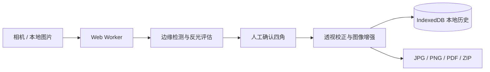

<p align="center">
  
</p>

<h1 align="center">清晰扫描 · Clear Scan</h1>

<p align="center">
  隐私优先、完全在浏览器本地处理的证件与文档扫描 PWA。
</p>

<p align="center">
  <strong>简体中文</strong> · <a href="./README.en.md">English</a>
</p>

<p align="center">
  <a href="./LICENSE"></a>
  
  
  
  
</p>

<p align="center">
  <a href="https://github.com/rmb122/clear-scan">源代码</a> ·
  <a href="https://github.com/rmb122/clear-scan/issues">问题反馈</a>
</p>

## 项目简介

清晰扫描将手机或电脑浏览器变成一台轻量扫描仪。它可以从系统相机、网页摄像头或本地图片获取内容，自动识别文档边缘并校正透视，然后在设备上完成裁剪、增强、历史保存和文件导出。

项目没有图片上传接口，也不要求注册账号。扫描原图和编辑记录保存在当前浏览器的 IndexedDB 中，图像处理运行在 Web Worker 内，不会阻塞主要界面。

## 核心能力

### 三种扫描模式

| 模式   | 主要能力                                             | 典型输出                                    |
| ------ | ---------------------------------------------------- | ------------------------------------------- |
| 身份证 | 引导拍摄人像面与国徽面，按标准卡片比例识别和透视校正 | 正反面大图排版到一张 A4；支持 JPG、PNG、PDF |
| 护照   | 支持资料页单页和展开双页，并使用对应比例辅助边缘识别 | JPG、PNG、PDF；多页时可导出 PDF 或 ZIP      |
| 文档   | 批量导入、连续添加、页面排序和多页管理               | 单页 JPG/PNG、多页 PDF、JPG 图片包 ZIP      |

> 身份证 A4 输出以清晰查看为目标，会放大正反两面，并不是 1:1 实体尺寸复印件。

### 拍摄与裁剪

- 支持系统相机、网页摄像头、相册选择、桌面文件选择和拖放上传。
- 支持 JPEG、PNG、WebP，以及浏览器能够解码的 HEIC/HEIF。
- 使用 OpenCV.js 进行多候选边缘检测、置信度评估和透视校正。
- 自动结果不可靠时会要求人工确认，不会静默使用未经确认的裁剪框。
- 四个真实角点与拖拽圆柄分离，避免手指遮挡边缘；拖动时提供局部放大镜和中心十字。
- 检测轻微反光和严重过曝，在无法可靠恢复信息时提示重新拍摄。

### 图像增强

- 快捷方案：原版、智能增强。
- 光照修复：标准去阴影、亮度均衡。
- 反光修复：局部高光抑制。
- 色彩风格：原色、彩色增强、灰度、黑白。
- 细节处理：加锐。
- 高级微调：亮度、对比度、阴影或均衡强度、锐化强度。
- 支持顺时针或逆时针旋转 90°，不同效果分类可以组合使用。

### 本地历史与导出

- 项目、原图、缩略图、裁剪角点和增强参数都保存在当前浏览器中。
- 支持按名称搜索、按扫描类型筛选、删除单个项目或清空全部历史。
- 导出过程同样在本地完成，不调用服务端转换接口。
- 导出的 JPG/PNG 会重新编码，不携带原照片的 EXIF 或定位信息。

| 格式 | 使用场景                   | 说明                                                      |
| ---- | -------------------------- | --------------------------------------------------------- |
| PDF  | 证件归档或多页文档         | 文档可选择适应内容或统一 A4；身份证固定为 A4 单页大图排版 |
| JPG  | 单页图片或身份证正反面合图 | 兼容性好，使用有损压缩                                    |
| PNG  | 单页图片或身份证正反面合图 | 无损，但文件通常更大                                      |
| ZIP  | 多页护照或文档             | 每页渲染为独立 JPG 后打包                                 |

## 使用流程

1. 选择身份证、护照或文档模式。
2. 使用相机拍摄，或从相册、电脑导入图片。
3. 检查自动识别的四角；必要时使用偏移圆柄和放大镜精确调整。
4. 选择增强方案、组合效果并进行旋转或参数微调。
5. 确认所有页面后导出文件；项目会留在本地历史中，直到手动删除。

## 处理与数据流



整个流程没有云端图片处理节点。首次打开应用时仍需要下载页面资源和 OpenCV 图像引擎；资源缓存完成后可以离线继续使用。

## 隐私与能力边界

- 应用代码不会主动上传扫描图片，但你仍应在可信设备、可信浏览器和可信部署地址上处理敏感证件。
- 扫描记录只属于当前浏览器配置；清理网站数据、使用隐私模式或受到存储配额限制时，记录可能丢失。
- PWA 缓存与扫描历史是两套数据。卸载 PWA 不一定清除 IndexedDB，清理浏览器网站数据才会完整移除。
- 当前版本不包含 OCR、MRZ 文字识别、云同步、账号系统、电子签名或服务端备份。
- 去反光只能压低仍有细节的高光，已经完全过曝为纯白的文字无法恢复。
- HEIC/HEIF 能否导入取决于浏览器和操作系统的图片解码能力。
- 网页摄像头、Service Worker 和 PWA 安装通常要求 HTTPS 或 `localhost`；普通 HTTP 仍可用于基本的图片上传测试。

## 技术栈

| 模块       | 技术                                                    |
| ---------- | ------------------------------------------------------- |
| 界面       | React 19、TypeScript、Tailwind CSS 4、Radix UI、Lucide  |
| 构建       | Vite 8                                                  |
| 图像处理   | OpenCV.js、Web Worker、OffscreenCanvas                  |
| 本地存储   | Dexie、IndexedDB                                        |
| 文件导出   | pdf-lib、JSZip、Canvas 编码                             |
| PWA        | vite-plugin-pwa、Workbox                                |
| 状态与路由 | Zustand、React Router                                   |
| 质量保障   | Vitest、Testing Library、Playwright、Oxlint、TypeScript |

## 本地开发

### 环境要求

- Node.js `^20.19.0` 或 `>=22.12.0`
- pnpm 11（推荐）

### 启动开发服务器

```bash
git clone https://github.com/rmb122/clear-scan.git
cd clear-scan
pnpm install
pnpm dev
```

浏览器打开 Vite 输出的本地地址。开发环境默认使用站点根路径 `/`。

### 生产构建与预览

```bash
pnpm build
pnpm preview
```

构建结果位于 `dist/`。

### 质量检查

```bash
pnpm lint
pnpm typecheck
pnpm test
pnpm test:e2e
```

首次运行端到端测试前，如果本机尚未安装 Playwright Chromium：

```bash
pnpm exec playwright install chromium
```

## 部署到 GitHub Pages

仓库已经包含 [GitHub Pages 工作流](./.github/workflows/pages.yml)。默认配置针对名为 `clear-scan` 的项目站点，GitHub Actions 构建时会将 Vite 基础路径设置为 `/clear-scan/`。

1. 将仓库推送到 GitHub。
2. 打开仓库的 **Settings → Pages**。
3. 在 **Build and deployment** 中将 Source 设为 **GitHub Actions**。
4. 推送到 `main`，或在 Actions 页面手动运行 `Deploy GitHub Pages`。

如果仓库名称不是 `clear-scan`，请同步修改 [`vite.config.ts`](./vite.config.ts) 中的 `pagesBase`。如果使用根域名或其他子路径，也应将它改成实际部署路径。

部署到其他静态托管平台时，只需发布 `pnpm build` 生成的 `dist/`，并确保：

- 使用 HTTPS，以启用相机、Service Worker 和 PWA 安装。
- 所有静态资源都能在配置的 Vite `base` 路径下访问。
- 单页应用导航回退到 `index.html`；本项目使用 Hash Router，因此通常不需要额外的路径重写。

## 项目结构

```text
src/
├── components/       采集、裁剪、增强、导出和通用界面组件
├── hooks/            本地项目查询逻辑
├── lib/              数据库、几何、检测评分、导出与工具函数
├── pages/            首页、扫描工作区和历史记录
├── store/            全局界面状态
└── workers/          OpenCV 检测、透视和图像增强 Worker
e2e/                  Playwright 端到端测试与图片夹具
.github/workflows/    GitHub Pages 自动部署
```

## 参与贡献

欢迎提交问题和改进：

1. Fork 仓库并从 `main` 创建分支。
2. 保持修改范围清晰，并为行为变化补充测试。
3. 至少运行 `pnpm lint`、`pnpm typecheck` 和 `pnpm test`。
4. 提交 Pull Request，说明动机、行为变化和验证方式。

涉及边缘检测或图像增强的改动，建议同时加入有代表性的测试图片和预期结果，但不要提交真实身份证件或其他敏感资料。

## 开源协议

Copyright (C) 2026 rmb122

本项目以 [GNU Affero General Public License version 3](./LICENSE) 发布，SPDX 标识为 `AGPL-3.0-only`。如果你修改本项目并通过网络向用户提供服务，需要依照该协议向这些用户提供对应版本的源代码。

项目使用的第三方依赖、字体和资源仍分别遵循其各自的许可证。完整条款以 [LICENSE](./LICENSE) 为准。
